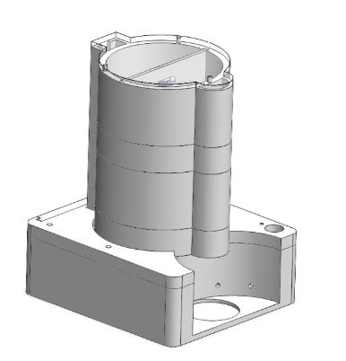
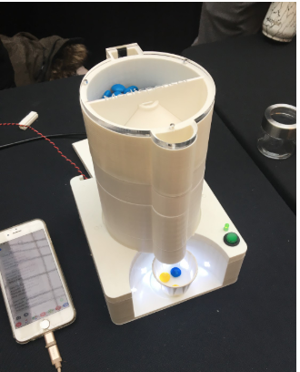
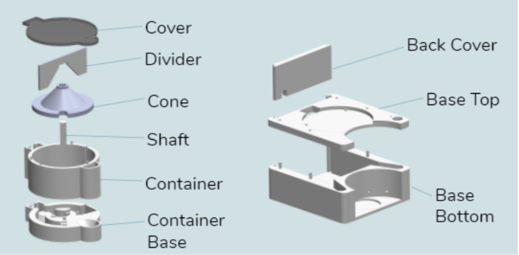

# Medispenser





## Install Python3
```
brew install python3
python3 --version
pip3 --version
```


## Install Packages
```
pip3 install -r requirements.txt
```
if new modules are added, add them to the requirement.txt

all modules can be seen by running `pip3 freeze`


## .env file
Create a .env file and copy the contents from .env.example and edit as needed


## DB Migration
`python3 manage.py migrate`


## Start Server
`python3 manage.py runserver`

Run at localhost:8000 by default


## Run Redis Server
`redis-server /usr/local/etc/redis.conf`


## Run Celery Worker
`celery worker -A medispenser -Q {queue_name}`


## Live Site
https://www.medispenser.herokuapp.com

## References
https://www.tutorialspoint.com/django/index.htm

https://docs.djangoproject.com/en/2.0/

https://docs.djangoproject.com/en/2.0/intro/


